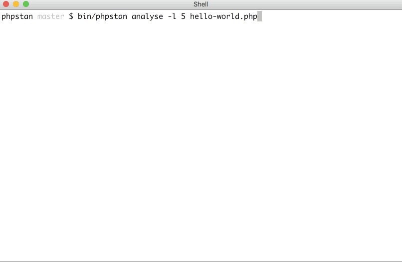

# PHPStan - PHP Static Analysis Tool

[](https://travis-ci.org/phpstan/phpstan)
[](https://packagist.org/packages/phpstan/phpstan)
[](https://packagist.org/packages/phpstan/phpstan)
[](https://github.com/phpstan/phpstan)

[](https://paypal.me/phpstan)

PHPStan focuses on finding errors in your code without actually running it. It catches whole classes of bugs
even before you write tests for the code.



PHPStan moves PHP closer to compiled languages in the sense that the correctness of each line of the code
can be checked before you run the actual line.

**[Read more about PHPStan on Medium.com »](https://medium.com/@ondrejmirtes/phpstan-2939cd0ad0e3)**

**[Try out PHPStan on the on-line playground! »](https://phpstan.org/)**

## Is PHPStan helping you to avoid bugs in production?
## Consider [supporting it on Patreon](https://www.patreon.com/phpstan) so I'm able to make it even more awesome!

*I offer to issue invoices for contributions on PayPal and Patreon! [Contact me](mailto:ondrej@mirtes.cz) for details.*

It currently performs the following checks on your code:

* Existence of classes and interfaces in `instanceof`, `catch`, typehints, other language constructs and even annotations. PHP does not do this and just stays silent instead.
* Existence of variables while respecting scopes of branches and loops.
* Existence and visibility of called methods and functions.
* Existence and visibility of accessed properties and constants.
* Correct types assigned to properties.
* Correct number and types of parameters passed to constructors, methods and functions.
* Correct types returned from methods and functions.
* Correct number of parameters passed to `sprintf`/`printf` calls based on format strings.
* Useless casts like `(string) 'foo'`.
* Unused constructor parameters - they can either be deleted or the author forgot to
use them in the method body.
* Require calling `parent::__construct()` if the parent constructor exists.
* Only valid array key types are used (only integers, strings, floats, booleans and nulls).
* Duplicate array keys in literal arrays.
* Only iterables are passed to `foreach`.
* Correct case when referencing classes. Class names are case insensitive, but taking advantage of this is dangerous with autoloading on case-insensitive filesystems.
* Impossible checks (dead code) of incompatible types with `instanceof`, `===`, `!==` and various function checks like `is_int` or `is_null`.
* Always-defined and never-defined variables in `isset()` call.
* Validating phpDocs - finding incompatible types between phpDocs and native typehints.
* That only objects are passed to the `clone` keyword.

## Extensibility

Unique feature of PHPStan is the ability to define and statically check "magic" behaviour of classes -
accessing properties that are not defined in the class but are created in `__get` and `__set`
and invoking methods using `__call`.

See [Class reflection extensions](#class-reflection-extensions) and [Dynamic return type extensions](#dynamic-return-type-extensions).

You can also install official framework-specific extensions:

* [Doctrine](https://github.com/phpstan/phpstan-doctrine)
* [PHPUnit](https://github.com/phpstan/phpstan-phpunit)
* [Nette Framework](https://github.com/phpstan/phpstan-nette)
* [Dibi - Database Abstraction Library](https://github.com/phpstan/phpstan-dibi)
* [PHP-Parser](https://github.com/phpstan/phpstan-php-parser)

Unofficial extensions for other frameworks and libraries are also available:

* [Phony](https://github.com/eloquent/phpstan-phony)
* [Symfony Framework](https://github.com/lookyman/phpstan-symfony)
* [Prophecy](https://github.com/Jan0707/phpstan-prophecy)

New extensions are becoming available on a regular basis!

## Prerequisites

PHPStan requires PHP >= 7.0. You have to run it in environment with PHP 7.x but the actual code does not have to use
PHP 7.x features. (Code written for PHP 5.6 and earlier can run on 7.x mostly unmodified.)

PHPStan works best with modern object-oriented code. The more strongly-typed your code is, the more information
you give PHPStan to work with.

Properly annotated and typehinted code (class properties, function and method arguments, return types) helps
not only static analysis tools but also other people that work with the code to understand it.

## Installation

To start performing analysis on your code, require PHPStan in [Composer](https://getcomposer.org/):

```
composer require --dev phpstan/phpstan
```

Composer will install PHPStan's executable in its `bin-dir` which defaults to `vendor/bin`.

If you have conflicting dependencies or you want to install PHPStan globally, the best way is via a PHAR archive. You will always find the latest stable PHAR archive below the [release notes](https://github.com/phpstan/phpstan/releases). You can also use the [phpstan/phpstan-shim](https://packagist.org/packages/phpstan/phpstan-shim) package to install PHPStan via Composer without the risk of conflicting dependencies.

You can also use [PHPStan via Docker](https://github.com/phpstan/docker-image).

## First run

To let PHPStan analyse your codebase, you have use the `analyse` command and point it to the right directories.

So, for example if you have your classes in directories `src` and `tests`, you can run PHPStan like this:

```bash
vendor/bin/phpstan analyse src tests
```

PHPStan will probably find some errors, but don't worry, your code might be just fine. Errors found
on the first run tend to be:

* Extra arguments passed to functions (e. g. function requires two arguments, the code passes three)
* Extra arguments passed to print/sprintf functions (e. g. format string contains one placeholder, the code passes two values to replace)
* Obvious errors in dead code
* Magic behaviour that needs to be defined. See [Extensibility](#extensibility).

After fixing the obvious mistakes in the code, look to the following section
for all the configuration options that will bring the number of reported errors to zero
making PHPStan suitable to run as part of your continuous integration script.

## Rule levels

If you want to use PHPStan but your codebase isn't up to speed with strong typing
and PHPStan's strict checks, you can choose from currently 8 levels
(0 is the loosest and 7 is the strictest) by passing `--level` to `analyse` command. Default level is `0`.

This feature enables incremental adoption of PHPStan checks. You can start using PHPStan
with a lower rule level and increase it when you feel like it.

You can also use `--level max` as an alias for the highest level. This will ensure that you will always use the highest level when upgrading to new versions of PHPStan. Please note that this can create a significant obstacle when upgrading to a newer version because you might have to fix a lot of code to bring the number of errors down to zero.

## Configuration

Config file is passed to the `phpstan` executable with `-c` option:

```bash
vendor/bin/phpstan analyse -l 4 -c phpstan.neon src tests
```

When using a custom project config file, you have to pass the `--level` (`-l`)
option to `analyse` command (default value does not apply here).

[NEON file format](https://ne-on.org/) is very similar to YAML.
All the following options are part of the `parameters` section.

### Autoloading

PHPStan uses Composer autoloader so the easiest way how to autoload classes
is through the `autoload`/`autoload-dev` sections in composer.json.

#### Specify paths to scan

If PHPStan complains about some non-existent classes and you're sure the classes
exist in the codebase AND you don't want to use Composer autoloader for some reason,
you can specify directories to scan and concrete files to include using
`autoload_directories` and `autoload_files` array parameters:

```
parameters:
	autoload_directories:
		- %rootDir%/../../../build
	autoload_files:
		- %rootDir%/../../../generated/routes/GeneratedRouteList.php
```

`%rootDir%` is expanded to the root directory where PHPStan resides.

#### Autoloading for global installation

PHPStan supports global installation using [`composer global`](https://getcomposer.org/doc/03-cli.md#global) or via a [PHAR archive](#installation).
In this case, it's not part of the project autoloader, but it supports autodiscovery of the Composer autoloader
from current working directory residing in `vendor/`:

```bash
cd /path/to/project
phpstan analyse src tests # looks for autoloader at /path/to/project/vendor/autoload.php
```

If you have your dependencies installed at a different path
or you're running PHPStan from a different directory,
you can specify the path to the autoloader with the `--autoload-file|-a` option:

```bash
phpstan analyse --autoload-file=/path/to/autoload.php src tests
```

### Exclude files from analysis

If your codebase contains some files that are broken on purpose
(e. g. to test behaviour of your application on files with invalid PHP code),
you can exclude them using the `excludes_analyse` array parameter. String at each line
is used as a pattern for the [`fnmatch`](https://secure.php.net/manual/en/function.fnmatch.php) function.

```
parameters:
	excludes_analyse:
		- %rootDir%/../../../tests/*/data/*
```

### Include custom extensions

If your codebase contains php files with extensions other than the standard .php extension then you can add them
to the `fileExtensions` array parameter:

```
parameters:
	fileExtensions:
		- php
		- module
		- inc
```

### Universal object crates

Classes without predefined structure are common in PHP applications.
They are used as universal holders of data - any property can be set and read on them. Notable examples
include `stdClass`, `SimpleXMLElement` (these are enabled by default), objects with results of database queries etc.
Use `universalObjectCratesClasses` array parameter to let PHPStan know which classes
with these characteristics are used in your codebase:

```
parameters:
	universalObjectCratesClasses:
		- Dibi\Row
		- Ratchet\ConnectionInterface
```

### Add non-obviously assigned variables to scope

If you use some variables from a try block in your catch blocks, set `polluteCatchScopeWithTryAssignments` boolean parameter to `true`.

```php
try {
	$author = $this->getLoggedInUser();
	$post = $this->postRepository->getById($id);
} catch (PostNotFoundException $e) {
	// $author is probably defined here
	throw new ArticleByAuthorCannotBePublished($author);
}
```

If you are enumerating over all possible situations in if-elseif branches
and PHPStan complains about undefined variables after the conditions, you can write
an else branch with throwing an exception:

```php
if (somethingIsTrue()) {
	$foo = true;
} elseif (orSomethingElseIsTrue()) {
	$foo = false;
} else {
	throw new ShouldNotHappenException();
}

doFoo($foo);
```

I recommend leaving `polluteCatchScopeWithTryAssignments` set to `false` because it leads to a clearer and more maintainable code.

### Custom early terminating method calls

Previous example showed that if a condition branches end with throwing an exception, that branch does not have
to define a variable used after the condition branches end.

But exceptions are not the only way how to terminate execution of a method early. Some specific method calls
can be perceived by project developers also as early terminating - like a `redirect()` that stops execution
by throwing an internal exception.

```php
if (somethingIsTrue()) {
	$foo = true;
} elseif (orSomethingElseIsTrue()) {
	$foo = false;
} else {
	$this->redirect('homepage');
}

doFoo($foo);
```

These methods can be configured by specifying a class on whose instance they are called like this:

```
parameters:
	earlyTerminatingMethodCalls:
		Nette\Application\UI\Presenter:
			- redirect
			- redirectUrl
			- sendJson
			- sendResponse
```

### Ignore error messages with regular expresions

If some issue in your code base is not easy to fix or just simply want to deal with it later,
you can exclude error messages from the analysis result with regular expressions:

```
parameters:
	ignoreErrors:
		- '#Call to an undefined method [a-zA-Z0-9\\_]+::method\(\)#'
		- '#Call to an undefined method [a-zA-Z0-9\\_]+::expects\(\)#'
		- '#Access to an undefined property PHPUnit_Framework_MockObject_MockObject::\$[a-zA-Z0-9_]+#'
		- '#Call to an undefined method PHPUnit_Framework_MockObject_MockObject::[a-zA-Z0-9_]+\(\)#'
```

If some of the patterns do not occur in the result anymore, PHPStan will let you know
and you will have to remove the pattern from the configuration. You can turn off
this behaviour by setting `reportUnmatchedIgnoredErrors` to `false` in PHPStan configuration.

### Bootstrap file

If you need to initialize something in PHP runtime before PHPStan runs (like your own autoloader),
you can provide your own bootstrap file:

```
parameters:
	bootstrap: %rootDir%/../../../phpstan-bootstrap.php
```

### Custom rules

PHPStan allows writing custom rules to check for specific situations in your own codebase. Your rule class
needs to implement the `PHPStan\Rules\Rule` interface and registered as a service in the configuration file:

```
services:
	-
		class: MyApp\PHPStan\Rules\DefaultValueTypesAssignedToPropertiesRule
		tags:
			- phpstan.rules.rule
```

For inspiration on how to implement a rule turn to [src/Rules](https://github.com/phpstan/phpstan/tree/master/src/Rules)
to see a lot of built-in rules.

Check out also [phpstan-strict-rules](https://github.com/phpstan/phpstan-strict-rules) repository for extra strict and opinionated rules for PHPStan!

### Custom error formatters

By default, PHPStan outputs found errors into tables grouped by files to be easily human-readable. To change the output, you can use the `--errorFormat` CLI option. There's an additional built-in `raw` format with one-per-line errors intended for easy parsing. You can also create your own error formatter by implementing the `PHPStan\Command\ErrorFormatter\ErrorFormatter` interface:

```php
interface ErrorFormatter
{

	/**
	 * Formats the errors and outputs them to the console.
	 *
	 * @param \PHPStan\Command\AnalysisResult $analysisResult
	 * @param \Symfony\Component\Console\Style\OutputStyle $style
	 * @return int Error code.
	 */
	public function formatErrors(
		AnalysisResult $analysisResult,
		\Symfony\Component\Console\Style\OutputStyle $style
	): int;

}
```

Register the formatter in your `phpstan.neon`:

```
errorFormatter.awesome:
	class: App\PHPStan\AwesomeErrorFormatter
```

Use the name part after `errorFormatter.` as the CLI option value:

```bash
vendor/bin/phpstan analyse -c phpstan.neon -l 4 --errorFormat awesome src tests
```

## Class reflection extensions

Classes in PHP can expose "magical" properties and methods decided in run-time using
class methods like `__get`, `__set` and `__call`. Because PHPStan is all about static analysis
(testing code for errors without running it), it has to know about those properties and methods beforehand.

When PHPStan stumbles upon a property or a method that is unknown to built-in class reflection, it iterates
over all registered class reflection extensions until it finds one that defines the property or method.

Class reflection extension cannot have `PHPStan\Broker\Broker` (service for obtaining class reflections) injected in the constructor due to circular reference issue, but the extensions can implement `PHPStan\Reflection\BrokerAwareClassReflectionExtension` interface to obtain Broker via a setter.

### Properties class reflection extensions

This extension type must implement the following interface:

```php
namespace PHPStan\Reflection;

interface PropertiesClassReflectionExtension
{

	public function hasProperty(ClassReflection $classReflection, string $propertyName): bool;

	public function getProperty(ClassReflection $classReflection, string $propertyName): PropertyReflection;

}
```

Most likely you will also have to implement a new `PropertyReflection` class:

```php
namespace PHPStan\Reflection;

interface PropertyReflection
{

	public function getType(): Type;

	public function getDeclaringClass(): ClassReflection;

	public function isStatic(): bool;

	public function isPrivate(): bool;

	public function isPublic(): bool;

}
```

This is how you register the extension in project's PHPStan config file:

```
services:
	-
		class: App\PHPStan\PropertiesFromAnnotationsClassReflectionExtension
		tags:
			- phpstan.broker.propertiesClassReflectionExtension
```

### Methods class reflection extensions

This extension type must implement the following interface:

```php
namespace PHPStan\Reflection;

interface MethodsClassReflectionExtension
{

	public function hasMethod(ClassReflection $classReflection, string $methodName): bool;

	public function getMethod(ClassReflection $classReflection, string $methodName): MethodReflection;

}
```

Most likely you will also have to implement a new `MethodReflection` class:

```php
namespace PHPStan\Reflection;

interface MethodReflection
{

	public function getDeclaringClass(): ClassReflection;

	public function getPrototype(): self;

	public function isStatic(): bool;

	public function isPrivate(): bool;

	public function isPublic(): bool;

	public function getName(): string;

	/**
	 * @return \PHPStan\Reflection\ParameterReflection[]
	 */
	public function getParameters(): array;

	public function isVariadic(): bool;

	public function getReturnType(): Type;

}
```

This is how you register the extension in project's PHPStan config file:

```
services:
	-
		class: App\PHPStan\EnumMethodsClassReflectionExtension
		tags:
			- phpstan.broker.methodsClassReflectionExtension
```

## Dynamic return type extensions

If the return type of a method is not always the same, but depends on an argument passed to the method,
you can specify the return type by writing and registering an extension.

Because you have to write the code with the type-resolving logic, it can be as complex as you want.

After writing the sample extension, the variable `$mergedArticle` will have the correct type:

```php
$mergedArticle = $this->entityManager->merge($article);
// $mergedArticle will have the same type as $article
```

This is the interface for dynamic return type extension:

```php
namespace PHPStan\Type;

use PhpParser\Node\Expr\MethodCall;
use PHPStan\Analyser\Scope;
use PHPStan\Reflection\MethodReflection;

interface DynamicMethodReturnTypeExtension
{

	public function getClass(): string;

	public function isMethodSupported(MethodReflection $methodReflection): bool;

	public function getTypeFromMethodCall(MethodReflection $methodReflection, MethodCall $methodCall, Scope $scope): Type;

}
```

And this is how you'd write the extension that correctly resolves the EntityManager::merge() return type:

```php
public function getClass(): string
{
	return \Doctrine\ORM\EntityManager::class;
}

public function isMethodSupported(MethodReflection $methodReflection): bool
{
	return $methodReflection->getName() === 'merge';
}

public function getTypeFromMethodCall(MethodReflection $methodReflection, MethodCall $methodCall, Scope $scope): Type
{
	if (count($methodCall->args) === 0) {
		return $methodReflection->getReturnType();
	}
	$arg = $methodCall->args[0]->value;

	return $scope->getType($arg);
}
```

And finally, register the extension to PHPStan in the project's config file:

```
services:
	-
		class: App\PHPStan\EntityManagerDynamicReturnTypeExtension
		tags:
			- phpstan.broker.dynamicMethodReturnTypeExtension
```

There's also an analogous functionality for:

* **static methods** using `DynamicStaticMethodReturnTypeExtension` interface
and `phpstan.broker.dynamicStaticMethodReturnTypeExtension` service tag.
* **functions** using `DynamicFunctionReturnTypeExtension` interface and `phpstan.broker.dynamicFunctionReturnTypeExtension` service tag.

## Known issues

* If `include` or `require` are used in the analysed code (instead of `include_once` or `require_once`),
PHPStan will throw `Cannot redeclare class` error. Use the `_once` variants to avoid this error.
* If PHPStan crashes without outputting any error, it's quite possible that it's
because of a low memory limit set on your system. **Run PHPStan again** to read a couple of hints
what you can do to prevent the crashes.

## Code of Conduct

This project adheres to a [Contributor Code of Conduct](https://github.com/phpstan/phpstan/blob/master/CODE_OF_CONDUCT.md). By participating in this project and its community, you are expected to uphold this code.

## Contributing

Any contributions are welcome.

### Building

You can either run the whole build including linting and coding standards using

```bash
vendor/bin/phing
```

or run only tests using

```bash
vendor/bin/phing tests
```
